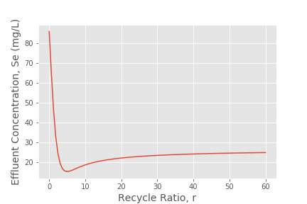

```python
from aide_design.play import*
from scipy import optimize

P = 16000 * u.mg/(u.m**2 * u.day) # capacity factor
alpha = 75 * 1/u.m # specific surface area
Q = 8 * 10**6 * u.L/u.day # flow rate
r = 2.0 # recycle ratio
HL = 21600 * u.L/(u.m**2 * u.day)  # hydraulic loading
S0 = 250 * u.mg/u.L
Se = 30 * u.mg/u.L

# Part 1) Filter area
A = Q*(1+r)/HL
print(A)

Kg = (50 + 1000 * 10**(-0.000055*(Q*(1+r)/A).magnitude))*(u.mg/u.L)
print(Kg)

# Part b) Reactor Height
H = ((Kg * np.log((S0+r*Se)/(Se*(1+r))))+(((S0-Se)/(1+r))))*(Q*(1+r))/(P*alpha*A)
print(H)

# Part c) BOD loading
SL = (Q*S0)/(A*H).to(u.mg/(u.day*u.L))
print(SL.to(u.kg/(u.day*u.m**3)))

# Part d) Kg as a function of Q
Q_range = np.linspace(10**4 * u.L/u.s, 10**7 * u.L/u.s, num = 30)
Kg_range = (50 + 1000 * 10**(-0.000055*(Q_range*(1+r)/A).magnitude))*(u.mg/u.L)
plt.plot(Q_range, Kg_range)
plt.xlabel('Q, L/s', fontsize=14)
plt.ylabel('Kg, mg/L', fontsize=14)
plt.suptitle('Kg as a function of Q', fontsize=18)
plt.savefig('Kg_Q.png')
plt.show()


# Part e) Optimum recycle ratio to achieve minimum Se
# create a vector of recycle ratios, from almost 0 to 1
r_vary = np.linspace(0.001, 60, 100)

def Se(r, S0, Q, A, P, alpha, H):
  """Calculate effluent concentration in a trickling filter."""
  Se = S0
  Kg = (50 + 1000 * 10**(-0.000055*(Q*(1+r)/A)))
  diff = Kg * np.log((S0 + r*Se)/(Se*(1+r))) + ((S0 - Se)/(1+r)) - (P*alpha*A*H)/(Q*(1+r))
  while diff<0:
      diff = Kg * np.log((S0 + r*Se)/(Se*(1+r))) + ((S0 - Se)/(1+r)) - (P*alpha*A*H)/(Q*(1+r))
      Se = Se - 0.01
  return Se

Se_vary = np.zeros(len(r_vary))
for i in range(0, len(r_vary)):
  Se_vary[i] = Se(r_vary[i], S0.magnitude, Q_test, A.magnitude, P.magnitude, alpha.magnitude, H.magnitude)

plt.plot(r_vary, Se_vary)
plt.xlabel('Recycle Ratio, r', fontsize=14)
plt.ylabel('Effluent Concentration, Se (mg/L)', fontsize=14)
plt.savefig('Se_by_r.png')
plt.show()

```

---------------------------

$$ HL = \frac{Q+Q_r}{A} $$
$$ A = \frac{Q(1+r)}{HL} $$

$$ SL = \frac{QS_0}{AH} $$

$$ K_g ln(\frac{S_0 + rS_e}{S_e(1+r)}) + \frac{S_0-S_e}{1+r} = \frac{P\alpha AH}{Q(1+r)} $$

$$ H = \frac{Q(1+r)}{P\alpha A}[K_g ln(\frac{S_0 + rS_e}{S_e(1+r)}) + \frac{S_0-S_e}{1+r}] $$

Question 2
```Python
K_AAS = 200
q_hat_AAS = 20
Y_AAS = 0.49
b_AAS = 0.05

K_ACP = 400
q_hat_ACP = 7
Y_ACP = 0.05
b_ACP = 0.03

S0_BOD = 1200 # mg/L

# a)


def theta_x_min(K, S0, Y, q_hat, b):
  return (K + S0)/(S0*(Y*q_hat - b) - b*K)

def S_min(K, Y, q_hat, b):
  return K*b/(Y*q_hat - b)

aerobic_theta_x_min = theta_x_min(K_AAS, S0_BOD, Y_AAS, q_hat_AAS, b_AAS) * u.day
print(aerobic_theta_x_min)

anaerobic_theta_x_min = theta_x_min(K_ACP, S0_BOD, Y_ACP, q_hat_ACP, b_ACP) * u.day
print(anaerobic_theta_x_min)

# b)
SF = 5
aerobic_theta_d = aerobic_theta_x_min * SF
anaerobic_theta_d = anaerobic_theta_x_min * SF

print(aerobic_theta_d)
print(anaerobic_theta_d)

#c)
aerobic_S_min = S_min(K_AAS, Y_AAS, q_hat_AAS, b_AAS)
anaerobic_S_min = S_min(K_ACP, Y_ACP, q_hat_ACP, b_ACP)

print(aerobic_S_min)
print(anaerobic_S_min)

#d)
def r(Se, S0, Q, A, P, alpha, H):
  """Calculate effluent concentration in a trickling filter."""
  r = 3
  Kg = (50 + 1000 * 10**(-0.000055*(Q*(1+r)/A)))
  diff = Kg * np.log((S0 + r*Se)/(Se*(1+r))) + ((S0 - Se)/(1+r)) - (P*alpha*A*H)/(Q*(1+r))
  while diff<0:
      Kg = (50 + 1000 * 10**(-0.000055*(Q*(1+r)/A)))
      diff = Kg * np.log((S0 + r*Se)/(Se*(1+r))) + ((S0 - Se)/(1+r)) - (P*alpha*A*H)/(Q*(1+r))
      r = r - 0.001
  return r

S_target = 30 * u.mg/u.L
print(r(S_target.magnitude, S0_BOD.magnitude, Q_test, A.magnitude, P.magnitude, alpha.magnitude, H.magnitude))

```
